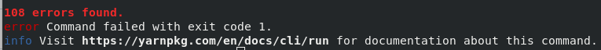
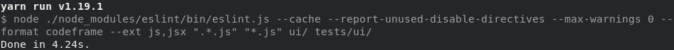

Mozilla treeherder project [issue](https://github.com/mozilla/treeherder/issues/5457).

## Diagnosis:
The issue requires enabling an `eslint` rule by removing a line that disabled it from the config file. This also requires fixing all violations of this rule in the code base. Enforcing a consistent code style is important in big projects, one of the benefits is enhancing readability which boosts developers productivity.
The rule I am enabling is using camelCase for variable names, this makes it easier for developer to identify variables when they're reading the code. In addition, fixing code style issues is usually on the low end of the priority scale, which means there is a good change they will never get fixed, incurring more technical debt as more non-styled code is added to the code base.

## Solution:
Solving this issue requires deleting the line that disables camelCase rule, and fixing all the code violations in the code base. To increase my productivity and reduce the time required for solving this, I will use VSCode ESLint extension which highlights all the files that contain code style violations and also the violations in these files. After renaming a variable name, I have to ensure that all usages of this variable (in the current file and other files as well) are also corrected.

## Testing:
After removing the line that disables the style rule, running `yarn run lint` displays the occurrences that violate this rule, in my case there were 108 such occurrences as shown by the snapshot below.

After fixing these errors, running `yarn run lint` should display no errors

## Pull Request:
This is [the PR](https://github.com/mozilla/treeherder/pull/5616) I submitted that fixes the issue (it got merged!)

